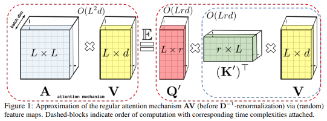

</img>

## Performer - Pytorch

[](https://badge.fury.io/py/performer-pytorch)

An implementation of <a href="https://arxiv.org/abs/2009.14794">Performer</a>, a linear attention-based transformer variant with a **F**ast **A**ttention **V**ia positive **O**rthogonal **R**andom features approach (FAVOR+).

## Install

```bash
$ pip install performer-pytorch
```

## Usage

Performer Language Model

```python
import torch
from performer_pytorch import PerformerLM

model = PerformerLM(
    num_tokens = 20000,
    max_seq_len = 2048,             # max sequence length
    dim = 512,                      # dimension
    depth = 12,                     # layers
    heads = 8,                      # heads
    causal = False,                 # auto-regressive or not
    nb_features = 256,              # number of random features, if not set, will default to (d * log(d)), where d is the dimension of each head
    generalized_attention = False,  # defaults to softmax approximation, but can be set to True for generalized attention
    kernel_fn = nn.ReLU(),          # the kernel function to be used, if generalized attention is turned on, defaults to Relu
    reversible = True,              # reversible layers, from Reformer paper
    ff_chunks = 10,                 # chunk feedforward layer, from Reformer paper
    use_scalenorm = False,          # use scale norm, from 'Transformers without Tears' paper
    use_rezero = False,             # use rezero, from 'Rezero is all you need' paper
    tie_embedding = False,          # multiply final embeddings with token weights for logits, like gpt decoder
    ff_glu = True,                  # use GLU variant for feedforward
    emb_dropout = 0.1,              # embedding dropout
    ff_dropout = 0.1,               # feedforward dropout
    attn_dropout = 0.1,             # post-attn dropout
    local_attn_heads = 4,           # 4 heads are local attention, 4 others are global performers
    local_window_size = 256         # window size of local attention
)

x = torch.randint(0, 20000, (1, 2048))
mask = torch.ones_like(x).bool()

model(x, mask = mask) # (1, 2048, 20000)
```

Plain Performer, if you are working with say images or other modalities

```python
import torch
from performer_pytorch import Performer

model = Performer(
    dim = 512,
    depth = 1,
    heads = 8,
    causal = True
)

x = torch.randn(1, 2048, 512)
model(x) # (1, 2048, 512)
```

Standalone self-attention layer with linear complexity in respect to sequence length, for replacing trained full-attention transformer self-attention layers.

```python
import torch
from performer_pytorch import SelfAttention

attn = SelfAttention(
    dim = 512,
    heads = 8,
    causal = False,
).cuda()

x = torch.randn(1, 1024, 512).cuda()
attn(x) # (1, 1024, 512)
```

To minimize model surgery, you could also simply rewrite the code, so that the attention step is done by the `FastAttention` module, as follows.

```python
import torch
from performer_pytorch import FastAttention

# queries / keys / values with heads already split and transposed to first dimension
# 8 heads, dimension of head is 64, sequence length of 512
q = torch.randn(1, 8, 512, 64)
k = torch.randn(1, 8, 512, 64)
v = torch.randn(1, 8, 512, 64)

attn_fn = FastAttention(
    dim_heads = 64,
    nb_features = 256,
    causal = False
)

out = attn_fn(q, k, v) # (1, 8, 512, 64)
# now merge heads and combine outputs with Wo
```

## Advanced

At the end of training, if you wish to fix the projection matrices to get the model to output deterministically, you can invoke the following

```python
model.fix_projection_matrices_()
```

Now your model will have fixed projection matrices across all layers

## Citations

```bibtex
@misc{choromanski2020rethinking,
    title   = {Rethinking Attention with Performers},
    author  = {Krzysztof Choromanski and Valerii Likhosherstov and David Dohan and Xingyou Song and Andreea Gane and Tamas Sarlos and Peter Hawkins and Jared Davis and Afroz Mohiuddin and Lukasz Kaiser and David Belanger and Lucy Colwell and Adrian Weller},
    year    = {2020},
    eprint  = {2009.14794},
    archivePrefix = {arXiv},
    primaryClass = {cs.LG}
}
```

```bibtex
@inproceedings{kitaev2020reformer,
    title       = {Reformer: The Efficient Transformer},
    author      = {Nikita Kitaev and Lukasz Kaiser and Anselm Levskaya},
    booktitle   = {International Conference on Learning Representations},
    year        = {2020},
    url         = {https://openreview.net/forum?id=rkgNKkHtvB}
}
```

```bibtex
@inproceedings{katharopoulos_et_al_2020,
    author  = {Katharopoulos, A. and Vyas, A. and Pappas, N. and Fleuret, F.},
    title   = {Transformers are RNNs: Fast Autoregressive Transformers with Linear Attention},
    booktitle = {Proceedings of the International Conference on Machine Learning (ICML)},
    year    = {2020}
}
```

```bibtex
@misc{bachlechner2020rezero,
    title   = {ReZero is All You Need: Fast Convergence at Large Depth},
    author  = {Thomas Bachlechner and Bodhisattwa Prasad Majumder and Huanru Henry Mao and Garrison W. Cottrell and Julian McAuley},
    year    = {2020},
    url     = {https://arxiv.org/abs/2003.04887}
}
```

```bibtex
@article{1910.05895,
    author  = {Toan Q. Nguyen and Julian Salazar},
    title   = {Transformers without Tears: Improving the Normalization of Self-Attention},
    year    = {2019},
    eprint  = {arXiv:1910.05895},
    doi     = {10.5281/zenodo.3525484},
}
```

```bibtex
@misc{shazeer2020glu,
    title   = {GLU Variants Improve Transformer},
    author  = {Noam Shazeer},
    year    = {2020},
    url     = {https://arxiv.org/abs/2002.05202}
}
```

```bibtex
@misc{roy*2020efficient,
    title   = {Efficient Content-Based Sparse Attention with Routing Transformers},
    author  = {Aurko Roy* and Mohammad Taghi Saffar* and David Grangier and Ashish Vaswani},
    year    = {2020},
    url     = {https://arxiv.org/pdf/2003.05997.pdf}
}
```
